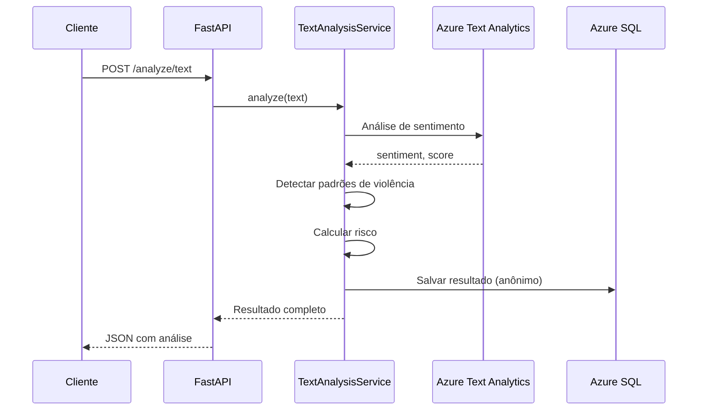
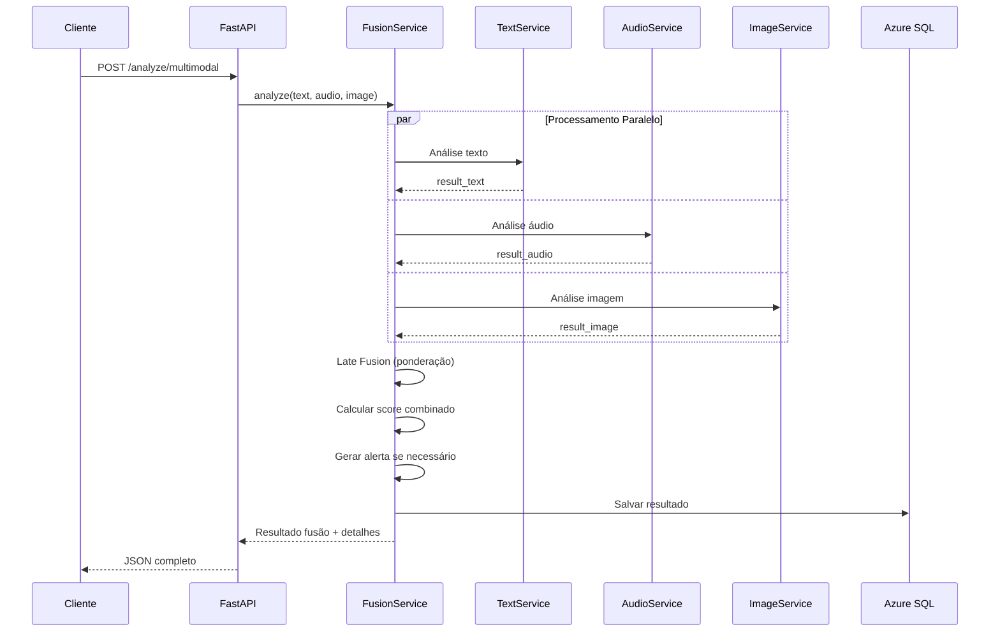
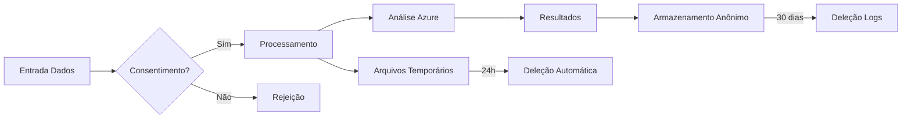

# Arquitetura do Sistema

## 1. Visão Geral

Sistema **multimodal** que processa **texto, áudio e vídeo** usando **Azure Cognitive Services** para identificar sinais de violência doméstica e riscos à saúde mental feminina.

```
┌─────────────────────────────────────────────────────────────────────────────┐
│                              CLIENTES                                        │
│  (Médicos, Enfermeiros, Sistemas de Saúde)                                  │
└─────────────────────────────────────────────────────────────────────────────┘
                                     │
                                     ▼
┌─────────────────────────────────────────────────────────────────────────────┐
│                           API REST (FastAPI)                               │
│  ┌──────────────┐ ┌──────────────┐ ┌──────────────┐ ┌──────────────┐     │
│  │  /analyze/   │ │  /analyze/   │ │  /analyze/   │ │  /analyze/   │     │
│  │    text      │ │   audio      │ │   image      │ │  multimodal  │     │
│  └──────────────┘ └──────────────┘ └──────────────┘ └──────────────┘     │
│                                                                             │
│  ┌─────────────────────────────────────────────────────────────────────┐ │
│  │                         MIDDLEWARE                                   │ │
│  │  • Rate Limit  • Logging  • Validation  • Error Handling              │ │
│  └─────────────────────────────────────────────────────────────────────┘ │
│                                                                             │
│  ┌─────────────────────────────────────────────────────────────────────┐ │
│  │                         SERVICES                                     │ │
│  │  ┌─────────────┐ ┌─────────────┐ ┌─────────────┐ ┌─────────────┐    │ │
│  │  │TextAnalysis │ │AudioAnalysis│ │ImageAnalysis│ │  Fusion     │    │ │
│  │  │  Service    │ │  Service    │ │  Service    │ │  Service    │    │ │
│  │  └─────────────┘ └─────────────┘ └─────────────┘ └─────────────┘    │ │
│  └─────────────────────────────────────────────────────────────────────┘ │
└─────────────────────────────────────────────────────────────────────────────┘
       │              │                │              │
       ▼              ▼                ▼              ▼
┌──────────────┐ ┌──────────────┐ ┌──────────────┐ ┌──────────────┐
│   Azure      │ │   Azure      │ │   Azure      │ │   Azure      │
│   Text       │ │   Speech     │ │   Computer   │ │   SQL        │
│   Analytics  │ │   Services   │ │   Vision     │ │   Database   │
│              │ │              │ │              │ │              │
│  Sentiment   │ │  Speech-to-  │ │  Face        │ │  Metadata    │
│  Analysis    │ │  Text        │ │  Analysis    │ │  Storage     │
│  NLP         │ │  Emotion     │ │  Emotion     │ │  Results     │
│              │ │              │ │              │ │              │
│  Free: 5k    │ │  Free: 5h    │ │  Free: 5k    │ │  Free: 250GB │
│  req/mês     │ │  áudio/mês   │ │  trans/mês   │ │              │
└──────────────┘ └──────────────┘ └──────────────┘ └──────────────┘
       │              │                │
       ▼              ▼                ▼
┌──────────────────────────────────────────────────────────────┐
│                    AZURE BLOB STORAGE                        │
│  ┌──────────────┐ ┌──────────────┐ ┌──────────────┐        │
│  │   Audios     │ │   Imagens    │ │   Logs       │        │
│  │   (temp)     │ │   (temp)     │ │   (temp)     │        │
│  └──────────────┘ └──────────────┘ └──────────────┘        │
│                                                              │
│  Free: 5GB + 20k read ops + 10k write ops                   │
└──────────────────────────────────────────────────────────────┘
```

---

## 2. Fluxo de Processamento

### 2.1 Análise de Texto



### 2.2 Análise de Áudio

```mermaid
sequenceDiagram
    participant C as Cliente
    participant API as FastAPI
    participant S as AudioAnalysisService
    AZ as Azure Speech
    Storage as Azure Blob
    DB as Azure SQL

    C->>API: POST /analyze/audio (upload)
    API->>Storage: Salvar arquivo temporário
    Storage-->>API: URL do arquivo
    API->>S: analyze(audio_url)
    S->>AZ: Speech-to-Text
    AZ-->>S: Transcrição
    S->>S: Analisar transcrição
    S->>S: Detectar pausas, entonação
    S->>DB: Salvar resultado
    S->>Storage: Deletar arquivo (LGPD)
    S-->>API: Resultado
    API-->>C: JSON com transcrição + análise
```

### 2.3 Análise Multimodal (Fusão)



---

## 3. Componentes

### 3.1 Camada API (FastAPI)

```python
# src/api/routes/text.py
@router.post("/analyze/text", response_model=TextAnalysisResponse)
async def analyze_text(request: TextAnalysisRequest):
    result = await text_service.analyze(request.texto)
    return result

# src/api/routes/audio.py
@router.post("/analyze/audio", response_model=AudioAnalysisResponse)
async def analyze_audio(audio: UploadFile = File(...)):
    result = await audio_service.analyze(audio)
    return result

# src/api/routes/multimodal.py
@router.post("/analyze/multimodal", response_model=MultimodalResponse)
async def analyze_multimodal(
    texto: str = Form(...),
    audio: UploadFile = File(None),
    imagem: UploadFile = File(None)
):
    result = await fusion_service.analyze(texto, audio, imagem)
    return result
```

### 3.2 Camada Services

```python
# src/services/text_analysis.py
class TextAnalysisService:
    def __init__(self, azure_client: TextAnalyticsClient):
        self.azure = azure_client

    async def analyze(self, text: str) -> TextResult:
        # Chamar Azure Text Analytics
        sentiment = self.azure.analyze_sentiment(text)

        # Processamento local: detectar padrões
        risco = self._detectar_risco(text, sentiment)
        palavras = self._extrair_palavras_chave(text)

        return TextResult(
            sentimento=sentiment.sentiment,
            score=sentiment.confidence_scores.negative,
            risco_violencia=risco,
            palavras_chave=palavras
        )

# src/services/fusion.py
class FusionService:
    def __init__(self, text_svc, audio_svc, image_svc):
        self.text_svc = text_svc
        self.audio_svc = audio_svc
        self.image_svc = image_svc

    async def analyze(self, texto, audio, imagem) -> FusionResult:
        # Processar em paralelo
        tasks = []
        if texto:
            tasks.append(self.text_svc.analyze(texto))
        if audio:
            tasks.append(self.audio_svc.analyze(audio))
        if imagem:
            tasks.append(self.image_svc.analyze(imagem))

        results = await asyncio.gather(*tasks)

        # Late fusion: combinar scores
        risco_fusao = self._calcular_risco_combinado(results)

        return FusionResult(
            risco=risco_fusao,
            detalhes=results
        )
```

### 3.3 Processamento de Vídeo (Frame Extraction)

```python
# src/services/video_frame_extractor.py
import cv2
from pathlib import Path
from typing import List

class VideoFrameExtractor:
    """Extrai frames de vídeos para análise com Azure Computer Vision"""

    def __init__(self, interval_seconds: int = 5):
        self.interval = interval_seconds

    async def extract_frames(self, video_path: Path) -> List[Path]:
        """
        Extrai frames do vídeo a cada N segundos
        Retorna: Lista de caminhos dos frames extraídos
        """
        frames = []
        cap = cv2.VideoCapture(str(video_path))

        fps = cap.get(cv2.CAP_PROP_FPS)
        frame_interval = int(fps * self.interval)

        frame_count = 0
        while True:
            ret, frame = cap.read()
            if not ret:
                break

            if frame_count % frame_interval == 0:
                frame_path = Path(f"/tmp/frame_{frame_count}.jpg")
                cv2.imwrite(str(frame_path), frame)
                frames.append(frame_path)

            frame_count += 1

        cap.release()
        return frames
```

### 3.4 Azure Integration

```python
# src/infrastructure/azure_clients.py
from azure.ai.textanalytics import TextAnalyticsClient
from azure.cognitiveservices.speech import SpeechConfig
from azure.cognitiveservices.vision.computervision import ComputerVisionClient

class AzureClientFactory:
    def __init__(self, config: AzureConfig):
        self.config = config

    def create_text_analytics_client(self) -> TextAnalyticsClient:
        credential = AzureKeyCredential(self.config.text_key)
        return TextAnalyticsClient(
            endpoint=self.config.text_endpoint,
            credential=credential
        )

    def create_speech_config(self) -> SpeechConfig:
        return SpeechConfig(
            subscription=self.config.speech_key,
            region=self.config.speech_region
        )

    def create_computer_vision_client(self) -> ComputerVisionClient:
        return ComputerVisionClient(
            endpoint=self.config.vision_endpoint,
            credentials=CognitiveServicesCredentials(self.config.vision_key)
        )
```

---

## 4. Modelos de Dados

### 4.1 Request - Análise de Texto

```python
class TextAnalysisRequest(BaseModel):
    texto: str = Field(..., min_length=10, max_length=5000,
                       description="Texto para análise")
    tipo: Optional[str] = Field(default="geral",
                               description="Tipo: diario, prontuario, relato")
    patient_id: Optional[str] = Field(default=None,
                                      description="ID anônimo do paciente")
```

### 4.2 Response - Análise Multimodal

```json
{
  "fusao": {
    "risco_violencia": "alto",
    "risco_saude_mental": "alto",
    "confiança": 0.92,
    "alerta": true,
    "recomendacao": "Encaminhar para equipe multidisciplinar"
  },
  "texto": {
    "sentimento": "negativo",
    "score": -0.85,
    "risco": "medio",
    "confiança": 0.75,
    "palavras_chave": ["ansiosa", "medo"]
  },
  "audio": {
    "transcricao": "Não sei se posso contar...",
    "sentimento": "negativo",
    "risco": "alto",
    "confiança": 0.88,
    "voz_tremida": true,
    "pausas_suspeitas": 3
  },
  "imagem": {
    "emoção": "tristeza",
    "risco": "medio",
    "confiança": 0.70,
    "expressoes": ["evitando_olho"]
  },
  "metadata": {
    "correlation_id": "uuid",
    "timestamp": "2026-04-05T14:30:00Z",
    "tempo_processamento_ms": 4500
  }
}
```

---

## 5. Azure Free Tier - Gestão de Limites

### Estratégia de Rate Limiting

```python
# src/core/rate_limit.py
RATE_LIMITS = {
    "text_analytics": {
        "monthly_limit": 5000,
        "daily_limit": 160,  # 5000 / 30 dias
        "per_minute": 10     # Proteção extra
    },
    "speech": {
        "monthly_limit": 300,  # minutos (5h)
        "daily_limit": 10,     # minutos
        "per_request": 5       # max 5 min por request
    },
    "computer_vision": {
        "monthly_limit": 5000,
        "daily_limit": 160,
        "per_minute": 10
    }
}

async def check_rate_limit(service: str) -> bool:
    """Verifica se ainda há quota disponível"""
    usage = await get_usage_from_cache(service)
    limit = RATE_LIMITS[service]["daily_limit"]
    return usage < limit
```

---

## 6. Segurança e LGPD

### Fluxo de Dados Sensíveis

```
Entrada:
  ├── Texto: Processado imediatamente, não armazenado
  ├── Áudio: Armazenado temporariamente (Azure Blob, 24h)
  └── Imagem: Armazenada temporariamente (Azure Blob, 24h)

Saída:
  ├── Resultados: Armazenados (Azure SQL), anônimos
  ├── Logs: Sem conteúdo sensível
  └── Arquivos: Deletados após processamento
```

### Medidas de Segurança:

1. **Criptografia em Trânsito**: TLS 1.3
2. **Criptografia em Repouso**: Azure Storage/SQL encrypted
3. **Anonimização**: patient_id hash, sem dados pessoais
4. **Retenção Mínima**: Arquivos de mídia 24h, logs 30 dias
5. **Consentimento**: Flag obrigatório no request
6. **Acesso**: API Key (futuro), logs auditáveis

---

## 7. Containerização

### Dockerfile

```dockerfile
FROM python:3.11-slim as builder

WORKDIR /app
RUN pip install poetry

COPY pyproject.toml poetry.lock ./
RUN poetry export -f requirements.txt --output requirements.txt --without-hashes

FROM python:3.11-slim

WORKDIR /app
RUN useradd -m -u 1000 appuser

COPY --from=builder /app/requirements.txt .
RUN pip install --no-cache-dir -r requirements.txt

COPY src/ ./src/

USER appuser

EXPOSE 8000

CMD ["uvicorn", "src.api.main:app", "--host", "0.0.0.0", "--port", "8000"]
```

### Docker Compose

```yaml
version: '3.8'
services:
  api:
    build: .
    ports:
      - "8000:8000"
    environment:
      - AZURE_TEXT_KEY=${AZURE_TEXT_KEY}
      - AZURE_SPEECH_KEY=${AZURE_SPEECH_KEY}
      - AZURE_VISION_KEY=${AZURE_VISION_KEY}
      - AZURE_SQL_CONNECTION=${AZURE_SQL_CONNECTION}
    env_file:
      - .env
    volumes:
      - ./temp:/app/temp  # Para uploads temporários

  # Opcional: Redis para cache e rate limiting
  redis:
    image: redis:7-alpine
    volumes:
      - redis_data:/data

volumes:
  redis_data:
```

---

## 8. Fluxo de Dados LGPD-Compliant



---

## 9. Monitoramento

### Métricas Principais

```python
# src/core/metrics.py
METRICS = {
    "requests_total": Counter("requests_total", "Total requests", ["endpoint"]),
    "request_duration": Histogram("request_duration", "Request duration"),
    "azure_quota_remaining": Gauge("azure_quota", "Remaining quota", ["service"]),
    "analysis_results": Counter("analysis_results", "Results by risk", ["risk_level"])
}
```

### Alertas

- Quota Azure > 80%: Warning
- Latência > 10s: Error
- Erro Azure API: Critical
- Falso positivo detectado: Review
